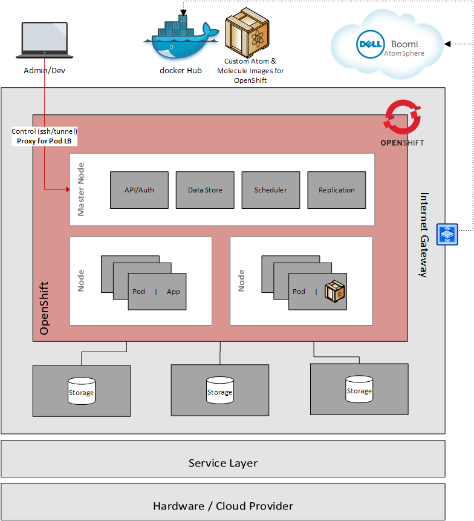
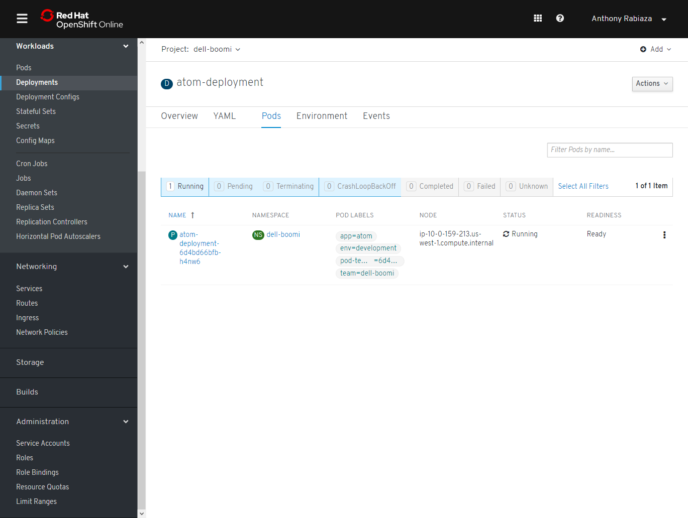
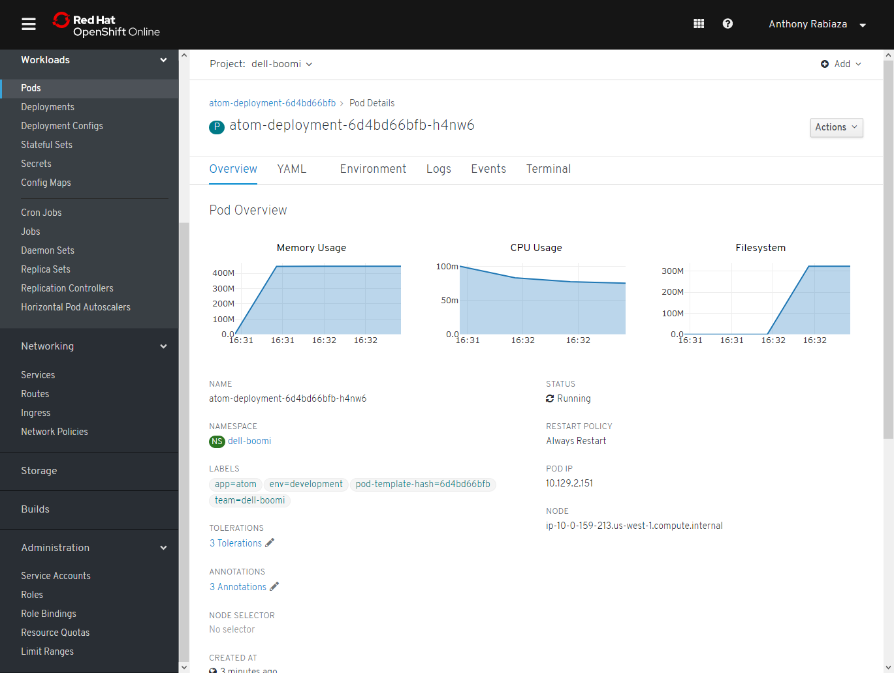

# Setup of a Dell Boomi Atom on OpenShift

The deployment of the Atom on OpenShift is using a slightly different version of the Boomi Atom for Docker due to the facts that OpenShift has its own constraints (Pod will be assigned with a user ID generated by the platform, the root user cannot be used to run an image, etc).

I created a custom image to cope with the different constraints and allow the deployment of an Atom in OpenShift:  https://cloud.docker.com/repository/docker/anthonyrabiaza/openshift-boomi-atom/general

# Deployment of the Service

Connect to OpenShift Console and select Networking>Services

Click on "Create Service " and copy-paste the content of [service](atom/boomi-atom-service.yaml?raw=true)

Click on "Create"

# Deployment of Boomi Atom on OpenShift

Click on Workloads>Deployments

Click on “Create Deployment”

Click on "Create Deployment " and copy-paste the content of [deployment](boomi-atom-deployment.yaml?raw=true). Then replace the values wrapped in @@REPLACEME@@

You will see the new deployment with 1 Pod requested:

Click on "Pods" and refresh until the Status is "Running"

Check on AtomSphere that the Atom is added and have Gray status

Check on AtomSphere that the Atom switched from Gray to Blue. Then you can attach the Atom to an environment.

You can also check the details of the Pods and click on Events or Logs to see more information:
